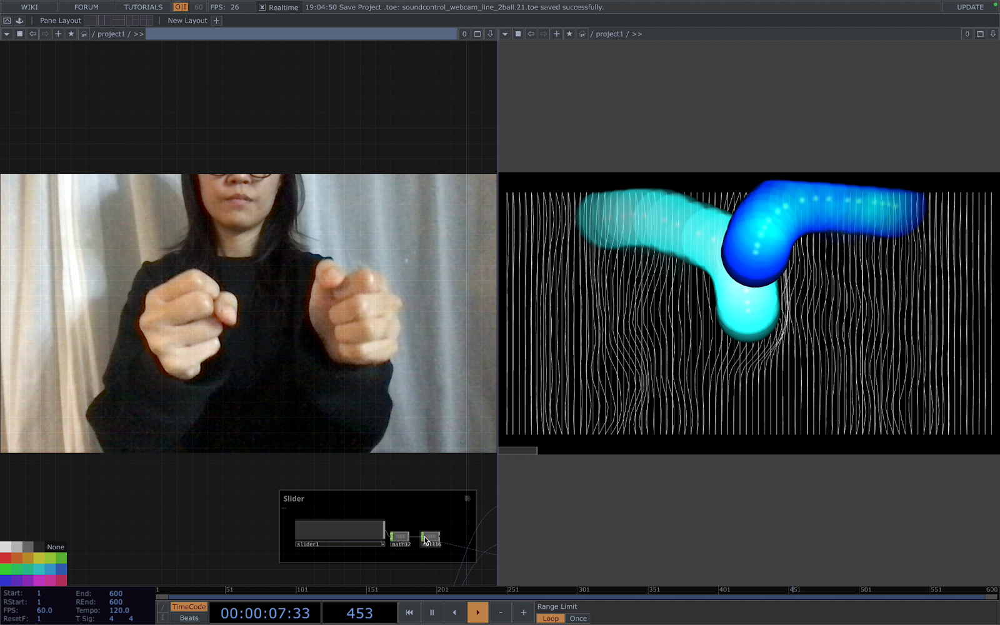
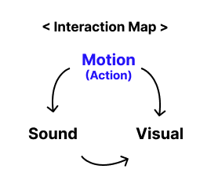
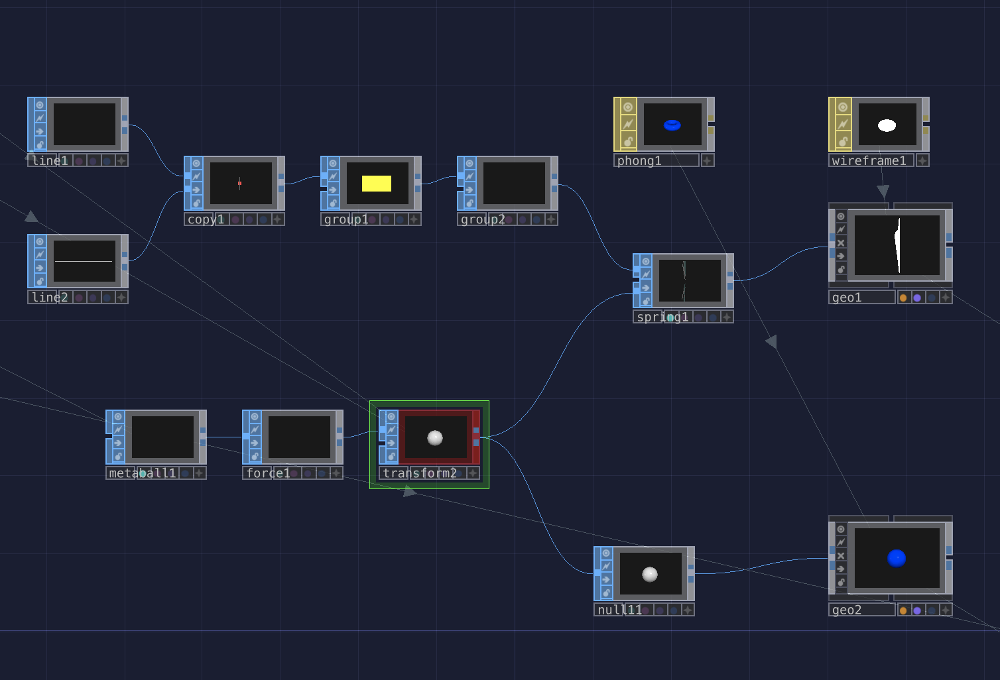
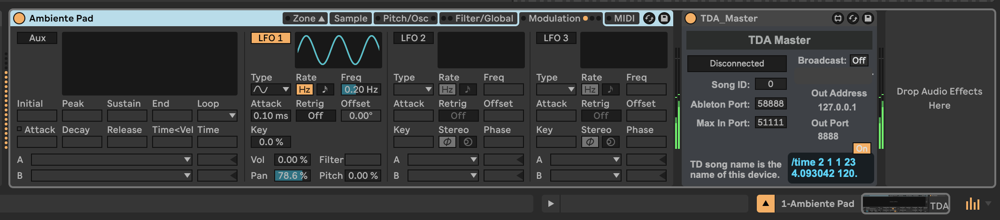
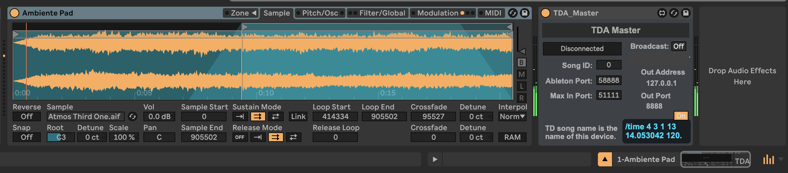
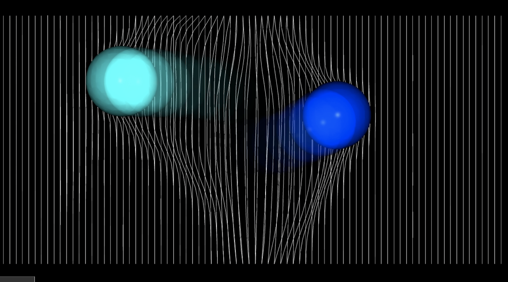

# Interactive Instrument Space

In this project, we aimed to experiment with how our actions can influence a digital space. Moving our hands, we created an interactive instrument to design sound in the digital space. According to the interaction map, three types of interactions were used: motion to visual, motion to sound, and sound to visual.

**Software used: TouchDesigner, Ableton**

***

## 1. Motion → Visual  
We created two types of visuals that respond to human motion: a line interaction and a metaball interaction. 

- **Motion Detection using the optical flow:** We used Crop TOP to a webcam video, cropping it into left and right areas. The right half tracked the right hand's movement, while the left half tracked the left hand. From the optical flow, we extracted two values: horizontal (left-right) and vertical (up-down) motion.
-	**Metaball Interaction:** The right hand was mapped to control a blue metaball, while the left hand controlled a white one. To synchronize the hand positions with the metaball movements, we utilized a Math CHOP to map the hand's vertical and horizontal positions to the corresponding coordinates of the metaballs.
- **Line Interaction:** Using the Spring SOP, which mimics the way lines bounce back like a spring, we made lines that move in response to the metaball's actions. This setup is similar to how piano keys move when pressed by our hands.

***

***

## 2. Motion → Sound 
We connected Ableton Live with TouchDesigner to allow real-time sound control based on the position of the metaballs. (Figure: TouchDesigner + Ableton screenshot). By moving the right and left metaballs with each hand, we can control different pitches and volumes.

- **Pitch:** The lines on the screen are mapped like piano keys, where the pitch increases as the metaball moves from left to right.
- **Volume:** As the metaball moves from the bottom to the top of the screen, the volume increases accordingly. The size of the metaball (weight parameter) also gets larger

***

***

## 3. Sound → Visual 
As the volume increases, the feedback effect of the metaball also gets stronger using audio math chop. This sound visualization serves as a visual guide, helping users intuitively understand the motion-sound interaction.

***

***
**Live Demo:** https://youtu.be/Jxv_4OxCO1M

2024 Fall ID412 Midterm 
Symbat Bekzhigit (Motion to Visual)
Jaeran Choi (Motion to Sound / Sound to Visual / Interaction Integration)

